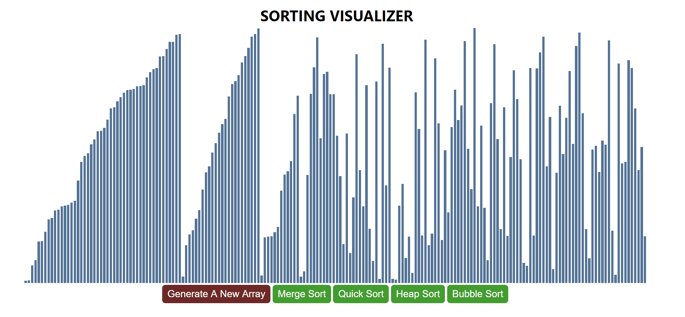

# SORTING VISUALIZER PROGRAM

## [View Project Here](https://sachu-sorting-visualization.netlify.app/)

A simple web-app created using React.js to visualize different sorting algorithms like, **Merge Sort, Quick Sort, Heap Sort, Bubble Sort**.

You can generate any random array using _Generate a New Array_ button.
The array elements are represented as a bar with it's height representing it's value.  
Then the array can be sorted using the soring buttons.

_`Currently only merge sort is implement. Other algorithms will be implemented in future`_

## MERGE SORT:

---

---

  
This project was bootstrapped with [Create React App](https://github.com/facebook/create-react-app).

## Available Scripts

In the project directory, you can run:

### `npm start`

Runs the app in the development mode. 
Open [http://localhost:3000](http://localhost:3000) to view it in the browser.

The page will reload if you make edits. 
You will also see any lint errors in the console.

### `npm run build`

Builds the app for production to the `build` folder. 
It correctly bundles React in production mode and optimizes the build for the best performance.

The build is minified and the filenames include the hashes. 
Your app is ready to be deployed!

See the section about [deployment](https://facebook.github.io/create-react-app/docs/deployment) for more information.
